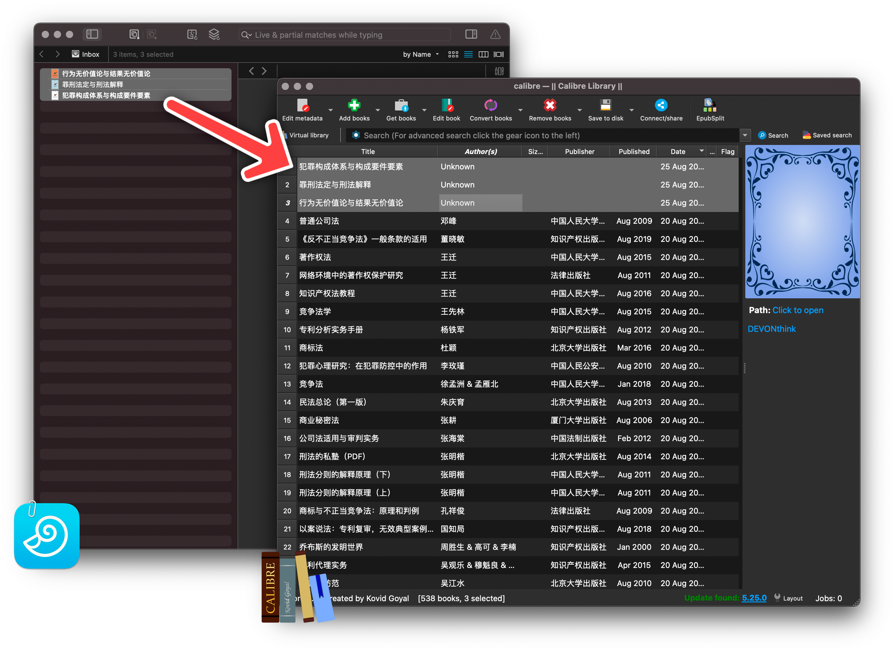

# Calibre index：索引 DEVONthink 书籍到 Calibre

将 DEVONthink 中的书籍批量索引到 Calibre，以便用 Calibre 集中管理。

相关文章：

- [《巴别图书馆计划（一）：为什么，以及如何用 Calibre 统一管理书籍》](https://utgd.net/article/20253)
- [《巴别图书馆计划（二）：批量索引 DEVONthink 书籍到 Calibre》](https://utgd.net/article/20254)

