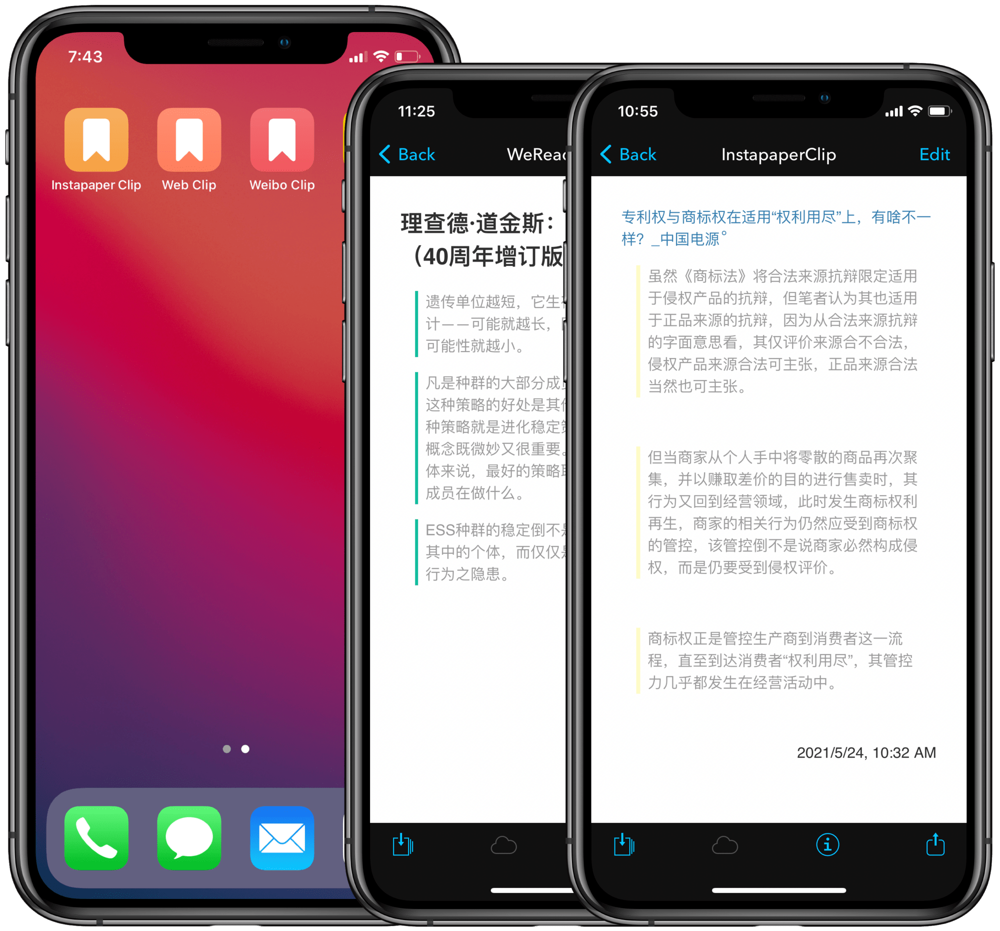

# DEVONthink Instapaper Clip 摘抄

本文介绍如何用 Shortcuts（快捷指令）将 Instapaper、微信读书中的高亮导入 DEVONthink，并将这些摘抄文件以书签形式置于 iOS 设备桌面，以便随时翻看。

使用方式请阅读原文。

- [Shortcuts 动作“DT InstapaperClip”下载](https://www.icloud.com/shortcuts/e8af1af68ef0465aa17e37c95de92288)
- [Shortcuts 动作“DT WeRead Clip”下载](https://www.icloud.com/shortcuts/93c0337e98e44801bb062eb4de7bbd0e)

出处：[《用 Shortcuts 和 DEVONthink 摘抄 Instapaper 内容》（预计2023年5月到6月发布）](https://utgd.net/article/20148)

系列文章：

- [用 Shortcuts 和 DEVONthink 摘抄微博内容](https://utgd.net/article/9167)
- [用 DEVONthink 做网页摘抄，夺回数据所有权](https://utgd.net/article/20106/)
- [用 Shortcuts 和 DEVONthink 摘抄 Kindle 内容（预计2023年5月到6月发布）](https://utgd.net/article/20149)

