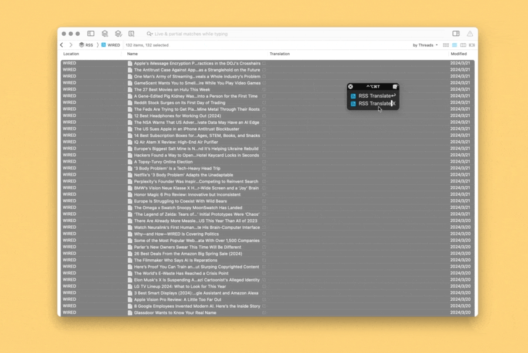

# DEVONthink RSS Translate X

批量翻译文章标题，便于快速检视文章，判断哪些值得继续阅读。高速版本，数秒即可翻译几百篇文章。

注意，本方案需配合 Keyboard Maestro 使用，因涉及的图形界面（GUI）自动化较多，暂无精力推出纯脚本版本，故较难移植到其他自动化工具中。

出处：[《本地 RSS 标题翻译高速方案（DEVONthink 版）》](https://utgd.net/article/20659)，预计2024年4月底发布。

