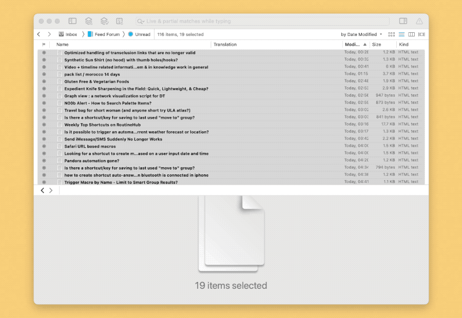

# DEVONthink RSS Translate

批量翻译文章标题，便于快速检视文章，判断哪些值得继续阅读。

20240116 更新：针对论坛类 RSS 中重复标题较多的情况，优化了翻译逻辑，不再重复翻译，速度有明显提升（可能比原来快几倍）。

DEVONthink Pro 用户如同时有 Keyboard Maestro，建议使用“RSS Translate.kmmacros”并下载[此 Shortcuts](https://www.icloud.com/shortcuts/40e3c743bee644c3a7c73d42c0a61b8a)，注意需将脚本中的 Shortcuts 动作名作相应修改。我只能保证维护这个版本，因为这是我自己在用的。

DEVONthink 用户请使用脚本“dt RSS Translate”，必需配套下载 Shortcuts 动作 [DEVONthink 普通版](https://www.icloud.com/shortcuts/0b0ef5e8291d4996a92174e261c22dcd)。

DEVONthink Pro 用户请使用脚本“dt RSS Translate Pro”，必需配套 Shortcuts 动作 [DEVONthink Pro 版](https://www.icloud.com/shortcuts/4745bfcd8f0b464c8e1b1d542e113a11)。

出处：[用 DEVONthink 批量翻译外文 RSS 标题 - #Untag](https://utgd.net/article/8406)

