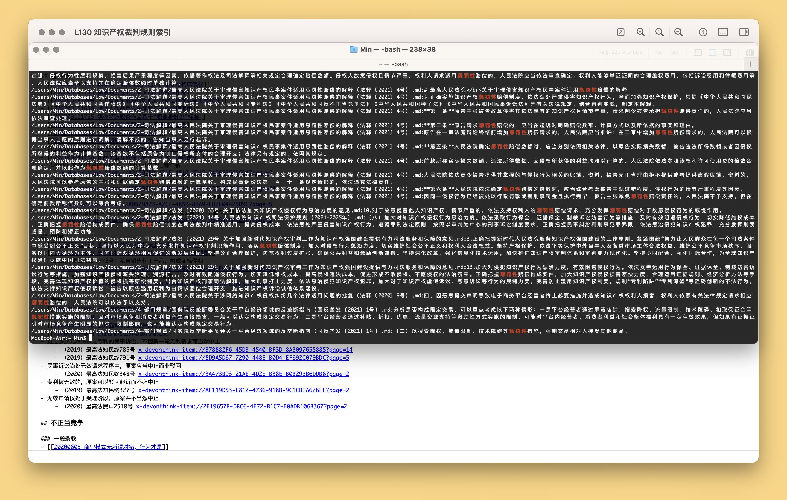

# Search Items in Index File with Terminal

搜索一个文件太窄，搜索整个文件夹太宽，有时还要把搜索范围限定在一小簇文件上。本文介绍一套基于 DEVONthink 的批量检索方法，深度、全文、精确检索指定文件。

出处：[《为什么，以及如何深度搜索 DEVONthink 文件清单内的所有文件》](https://utgd.net/article/20537)，预计2024年1月中下旬发布

