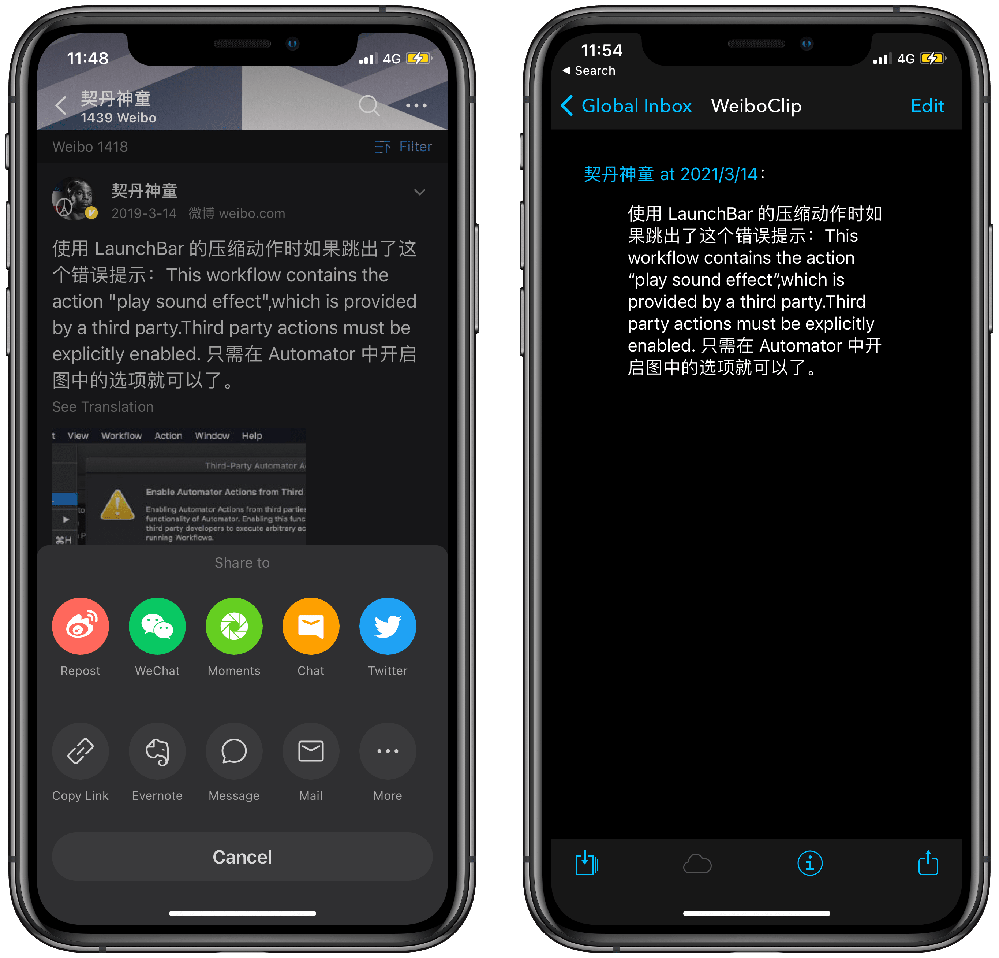

# DEVONthink Clip Weibo 微博摘抄

摘抄微博内容为 Markdown 格式。并保存到 DEVONthink，当然你也可以储存到其他位置，DEVONthink 只是选择之一，方便统一浏览、管理。

[Shortcuts 动作下载](https://www.icloud.com/shortcuts/cd70cbb014b84f9d89e23d3710c68e91)

出处：[《用 Shortcuts 和 DEVONthink 摘抄微博内容》](https://utgd.net/article/9690)。

系列文章：

- [用 DEVONthink 做网页摘抄，夺回数据所有权](https://utgd.net/article/20106/)
- [用 Shortcuts 和 DEVONthink 摘抄 Instapaper 内容](https://utgd.net/article/20148)
- [用 Shortcuts 和 DEVONthink 摘抄 Kindle 内容](https://utgd.net/article/20149)

